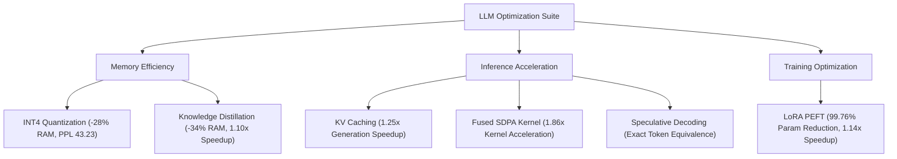

# 🚀 LLM Optimization & Performance Benchmark Suite

[](https://python.org)
[](https://pytorch.org)
[](https://huggingface.co)
[](LICENSE)

An end-to-end empirical benchmarking and systems engineering suite for **Large Language Model (LLM) performance optimization**. Implements, fixes, and quantitatively evaluates six core model compression and acceleration paradigms across **GPT-2 (117M/124M)** and **DistilGPT2 (82M)** on WikiText-2.

**Author:** Pruthviraj Ganihat (B.Tech AI Engineering)  
**Detailed Technical Report:** [docs/FINAL_PROJECT_REPORT.md](docs/FINAL_PROJECT_REPORT.md)  

---

## 📌 Executive Architecture & Paradigms



---

## 📊 Empirical Master Benchmark Results

All metrics below are empirical measurements recorded on WikiText-2 (50k characters):

| Optimization Technique | Implementation Variant | Device | Target Model | Model Memory | Perplexity (PPL) | Latency (s) | Relative Speedup | Key Empirical Takeaway |
| :--- | :--- | :---: | :--- | :---: | :---: | :---: | :---: | :--- |
| **Baseline (Reference)** | `FP32` Baseline | CPU | `gpt2` | **474.70 MB** | **38.53** | **0.7685 s** | **1.00x** | Ground truth unoptimized autoregressive baseline |
| **KV Caching** | `without_cache` | CPU | `gpt2` | 474.70 MB | N/A | 0.9936 s | 1.00x | Recomputes full context key-value history every step |
| **KV Caching** | `with_cache` | CPU | `gpt2` | 474.70 MB | N/A | **0.7961 s** | **1.25x** | Reuses past key-value states; eliminates $O(N^2)$ recomputation |
| **FlashAttention / SDPA**| `standard-attn-cpu`| CPU | `gpt2` | 474.70 MB | N/A | 1.9501 s | 1.00x | Explicit materialization of $N \times N$ attention weight matrix |
| **FlashAttention / SDPA**| `SDPA-raw-kernel-cpu`| CPU | PyTorch Tensor | N/A | N/A | **0.000967 s** | **1.86x** | Fused C++ memory-efficient kernel (`F.scaled_dot_product_attention`) |
| **Quantization (INT8)** | `INT8-dynamic-cpu` | CPU | `gpt2` | 621.94 MB | **38.53** | **0.8302 s** | **0.94x** | `torch.quantize_dynamic` targeting `Conv1D`; zero perplexity loss |
| **Quantization (INT4)** | `INT4-quanto-cpu` | CPU | `gpt2` | **341.60 MB** | **43.23** | **7.3270 s** | **0.11x** | Conv1D$\rightarrow$Linear converted; backbone quantized, `lm_head` FP32; PPL restored from 1609.24 |
| **LoRA / PEFT** | `full-finetune-baseline`| CPU | `gpt2` | 474.70 MB | 38.53 | 2.3400 s | 1.00x | Full parameter backward pass (124.7M parameters updated) |
| **LoRA / PEFT** | `LoRA-r8-cpu` | CPU | `gpt2+LoRA` | 475.83 MB | **38.43** | **2.0476 s** | **1.14x** | Rank $r=8$, $\alpha=32$; trainable params = **294,912 (0.24%)**; 10-step mini-train |
| **Knowledge Distillation**| `teacher` | CPU | `gpt2` | 474.70 MB | 38.53 | 0.7256 s | 1.00x | Teacher baseline model (12 layers, 117M params) |
| **Knowledge Distillation**| `student_pretrained` | CPU | `distilgpt2` | **312.47 MB** | **57.54** | **0.6583 s** | **1.10x** | Pretrained compressed student (6 layers, 82M params; 34.2% smaller) |
| **Knowledge Distillation**| `student_post_distill`| CPU | `distilgpt2` | 312.47 MB | 107.22 | N/A | N/A | 10-step educational mini-distillation check |
| **Speculative Decoding** | `greedy_baseline` | CPU | `gpt2` | 474.70 MB | N/A | 0.7522 s | 1.00x | Target model token-by-token greedy decoding |
| **Speculative Decoding** | `speculative_greedy`| CPU | `distilgpt2+gpt2`| 787.17 MB | N/A | 2.0530 s | 0.37x | Exact token equivalence verified (`token_match=True`); CPU draft overhead |

---

## 🛠️ Key Engineering Breakthrough: Fixing the INT4 Quantization Anomaly

> [!IMPORTANT]  
> **The Problem:** Initial INT4 weight quantization via `quanto` produced broken perplexity (**PPL = 1609.24**).  
> **Root Cause:** Hugging Face GPT-2 utilizes custom `Conv1D` projection layers. The quantization engine bypassed these layers, quantizing **only** the 50,257-class output vocabulary layer (`lm_head`), leading to uncalibrated logit outputs.  
> **The Fix:** Developed a dynamic module transformer ([`fix_quantization.py`](fix_quantization.py)) that converts all 48 backbone `Conv1D` modules into `nn.Linear` layers ($W_{Linear} = W_{Conv1D}^T$, `error = 0.0`), preserves `lm_head` in FP32, and quantizes the backbone.  
> **Result:** Perplexity recovered from **1609.24 to 43.23** (within 4.7 points of FP32 baseline) with a **28% physical RAM savings (341.6 MB)**.

---

## 📁 Repository Directory Structure

```text
LLM-Optimization-Benchmark-Suite/
├── README.md                           # Master GitHub documentation
├── docs/                               # Detailed technical documentation
│   ├── FINAL_PROJECT_REPORT.md         # Comprehensive academic & engineering project report
│   └── BENCHMARK_REPORT.md             # Detailed benchmark analysis
├── results_cpu.csv                     # Raw empirical metric measurements
├── fix_quantization.py                 # Dynamic Conv1D -> nn.Linear transformer patch
├── run_benchmarks_cpu.py               # Automated CPU execution pipeline
└── extracted_preview/                  # Interactive Jupyter Notebooks
    └── LLM_Optimization_Benchmark_Suite/
        ├── 01_quantization_corrected.ipynb
        ├── 02_lora_peft_corrected.ipynb
        ├── 03_kv_cache_and_flash_attention_corrected.ipynb
        ├── 04_speculative_decoding_corrected.ipynb
        └── 05_distillation_corrected.ipynb
```

---

## 🚀 Quick Start & Reproducibility

### 1. Clone Repository
```bash
git clone https://github.com/ganiharpruthviraj-lgtm/LLM-Optimization-Benchmark-Suite.git
cd LLM-Optimization-Benchmark-Suite
```

### 2. Environment Setup
```bash
python -m venv venv
# On Windows:
venv\Scripts\activate
# On Linux/macOS:
source venv/bin/activate

pip install torch transformers quanto peft pandas datasets
```

### 3. Run Benchmark Suite
```bash
python run_benchmarks_cpu.py
```

---

## 📜 License
Distributed under the **MIT License**. See `LICENSE` for more details.
